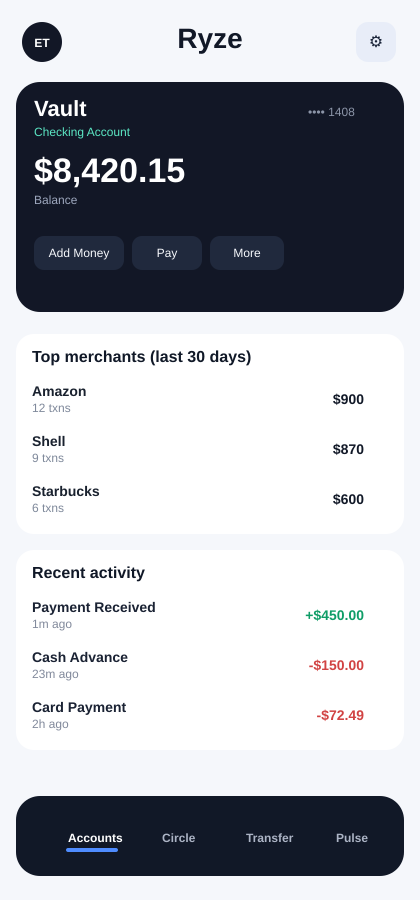

# Ryze Home Screen Design View

This is a static design preview (mock visual) of the Expo React Native `HomeScreen` composition.

## Expo setup (mobile folder)
1. `cd mobile`
2. `npm install`
3. `npm run start`
4. Press `i` for iOS simulator, `a` for Android emulator, or scan the QR in Expo Go.

## Notes
- This preview mirrors the implemented structure and visual hierarchy:
  - Header
  - Product card carousel style
  - Top merchants block
  - Recent activity block
  - Bottom navigation
- Final rendering can vary slightly by platform font metrics (iOS vs Android).
